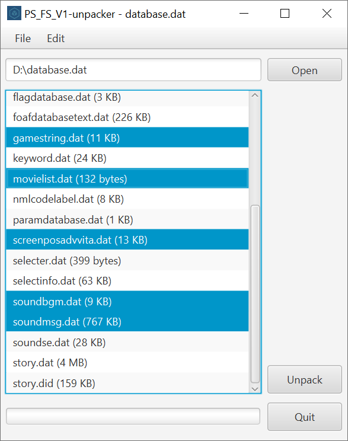

<a name="readme"/>

# 

 

**ps-fs-v1-unpacker** is a cross-platform GUI application for working with
archives containing the `PS_FS_V1` header, written in Java/JavaFX, which allows
to open and unpack files from such archives. The application has a simple
architecture and a user-friendly interface. During development, special
attention was paid to the simplicity and readability of the code, as well as the
ease of support. The project is covered by unit tests and documented.

## Table of Contents

[How it works](#how-it-works)  
[Features](#functionality)  
[Architecture](#architecture)  
[Code style](#style)  
[Getting started](#getting-started)  
[TODO](#todo)  
[License](#license)  
[Contribution](#contribution)

<a name="how-it-works"/>

## How it works

- [OpenJFX](https://openjfx.io) for user interface implementation;
- [Lombok](https://projectlombok.org) to avoid boilerplate code;
- [JUnit](https://junit.org/junit5/) for writing unit/integration tests.

Maven is used to automatically build the project.

<a name="features"/>

## Features

- A simple user interface, which alerts the user about errors, warns about the
  possible irreversibility of operations and informs about the successful
  completion of actions, the result of which is not obvious;
- Users can select specific files to unpack;
- Users can select the folder in which the files should be unpacked;
- Progress bar to track the progress of unpacking.

<a name="architecture"/>

## Architecture

- A clean package structure, with classes organized by purpose, area of
  responsibility, and level of abstraction;
- Following the principles of separation of concerns and loose coupling;
- A focus on generally accepted good coding principles and design patterns;
- Following encapsulation principles to provide convenient and secure
  interfaces.

<a name="style"/>

## Code style

- Focus to write simple and readable code;
- Simple and meaningful names of classes, methods and variables, separation of
  different aspects of functionality in separate methods;
- The code is accompanied by documentation, with complex points accompanied by
  comments;
- Division of complex code constructs into several primitive parts for better
  understanding;
- Limiting the number of characters by line width for better readability;
- Diverse operations are separated by indents;
- Avoiding "spaghetti code" (nested ifs);
- Using Lombok to avoid boilerplate code.

<a name="getting-started"/>

## Getting started

Java 11 or above is required.

### Run

```bash
mvnw clean javafx:run
```

### Build

```bash
mvnw clean package
```

File should be created at: target\ps-fs-v1-unpacker-1.0-SNAPSHOT.jar

### Run tests

```bash
mvnw clean test
``` 

<a name="todo"/>

## TODO

- [ ] Write integration tests for components for which unit testing is
  impossible (JavaFX controller and `SimpleAlertCreator`).
- [ ] Add hotkeys and mnemonics.

<a name="license"/>

## License

Copyright ©2022 Artyom Mameev.  
Licensed under the [MIT License](https://opensource.org/licenses/MIT).

<a name="contribution"/>

## Contribution

Any contributions to the project are welcome.